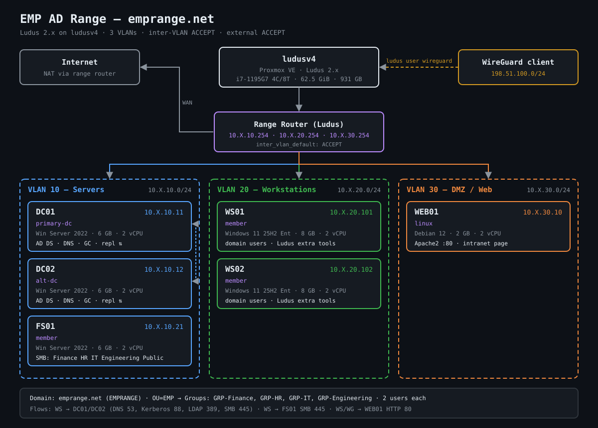

# EMP AD Range — emprange.net

Two DCs, a departmental file server, two Windows 11 workstations, and a Debian Apache web server, sized for **ludusv4** (i7-1195G7, 62.5 GiB RAM).

> Commands marked ✅ have been run successfully on ludusv4. Anything else: confirm with `ludus <command> --help` first, since Ludus 2.x flags have shifted from 1.x.

## Network diagram



Source SVG: `docs/network-diagram.svg` · PNG export: `docs/network-diagram.png`

## Layout

| VM    | Template                           | VLAN | IP              | RAM | vCPU | Role                    |
|-------|------------------------------------|------|-----------------|-----|------|-------------------------|
| DC01  | win2022-server-x64-template        | 10   | 10.X.10.11      | 6   | 2    | primary-dc              |
| DC02  | win2022-server-x64-template        | 10   | 10.X.10.12      | 6   | 2    | alt-dc                  |
| FS01  | win2022-server-x64-template        | 10   | 10.X.10.21      | 6   | 2    | member + fileserver     |
| WS01  | win11-25h2-x64-enterprise-template | 20   | 10.X.20.101     | 8   | 2    | member                  |
| WS02  | win11-25h2-x64-enterprise-template | 20   | 10.X.20.102     | 8   | 2    | member                  |
| WEB01 | debian-12-x64-server-template      | 30   | 10.X.30.10      | 2   | 2    | apache + intranet page  |

`X` is your range's second octet (shown in `ludus range list`).
VLAN 10 Servers · VLAN 20 Workstations · VLAN 30 DMZ/Web. Inter-VLAN and external traffic: **ACCEPT**.

## Repo contents

```
range-config.yml                    Ludus range config
requirements.yml                    Galaxy role (collections listed for reference; built into Ludus)
scripts/install-roles.sh            Installs all roles, loads the range config
docs/network-diagram.svg            Network diagram (SVG) + PNG export
roles/ludus-emprange-fileserver/    FS01: OUs, dept groups/users, NTFS, SMB shares, seed files
roles/ludus-emprange-web/           WEB01: intranet index page + health check (runs after geerlingguy.apache)
```

---

## 1. Add the roles

### All-in-one ✅

From the repo root (`/home/empadmin/Downloads/EMP-AD-Range` on ludusv4):

```bash
ludus ansible role add geerlingguy.apache --force; \
for r in ./roles/*/; do ludus ansible role add -d "$r" --force || echo "[!] failed: $r"; done; \
ludus ansible role list
```

This adds the Galaxy role, then every local role under `roles/`. New roles you drop into `roles/` get picked up automatically. Steps are joined with `;`, not `&&`, so an "already installed" error on one item does not stop the rest. `--force` reinstalls anything already present.

### Manually, one at a time ✅

Run from the repo root on the Ludus host (or any machine with the Ludus client and your API key).

```bash
# Galaxy role for Apache on WEB01 (--force makes it safe to re-run)
ludus ansible role add geerlingguy.apache --force

# Local custom roles (from directory; --force overwrites an existing copy)
ludus ansible role add -d ./roles/ludus-emprange-fileserver --force
ludus ansible role add -d ./roles/ludus-emprange-web --force

# Confirm everything is installed
ludus ansible role list
```

**Collections:** the FS01 role uses `ansible.windows`, `community.windows` and `microsoft.ad`. These ship with the Ansible community package, and Ludus installs them globally, so you don't add them yourself. `ludus ansible collection add` returns "Collection already installed" for them.

After editing a local role, re-add it so Ludus picks up the change:

```bash
ludus ansible role add -d ./roles/ludus-emprange-fileserver --force
```

Or run everything above plus the config load in one step:

```bash
./scripts/install-roles.sh
```

### Troubleshooting role installs

| Error | Cause | Fix |
|---|---|---|
| `geerlingguy.apache (x.y.z) is already installed` then `Request failed` | Role already on the server | Add `--force` |
| `Collection already installed ... installed globally` | Collection ships with Ludus | Nothing to do; skip it |
| Help text printed instead of running | Typo in subcommand (e.g. `collection role add`) | Use `ludus ansible role add` or `ludus ansible collection add` |

## 2. Deploy the range

```bash
# Load the config
ludus range config set -f range-config.yml

# Check what Ludus stored
ludus range config get

# Deploy and watch
ludus range deploy
ludus range logs -f
```

**If the DCs time out while promoting** (4C/8T host, five Windows VMs sysprepping at once), deploy the DCs first, then the rest:

```bash
ludus range deploy -l "<rangeID>-DC01,<rangeID>-DC02"
ludus range deploy
```

**Re-run only one VM** (e.g. FS01 ran before the domain was ready):

```bash
ludus range deploy -l "<rangeID>-FS01"
ludus range deploy -l "<rangeID>-WEB01"
```

**Re-run only the custom roles** without redoing the whole build:

```bash
ludus range deploy -t user-defined-roles
ludus range deploy -t user-defined-roles -l "<rangeID>-FS01"
```

**Snapshot once it's clean:**

```bash
ludus snapshot create clean-baseline -d "emprange.net clean deploy"
```

Do not run Packer template builds (flare-vm, win11-24h2-tpm) while a deploy is running.

## 3. Check the range is working

### From the Ludus host

```bash
# Deploy state and VM power state
ludus range list

# Any failed tasks from the last deploy
ludus range errors

# Get a WireGuard config to reach the range from your workstation
ludus user wireguard > emprange.conf
```

With WireGuard up (or from any range VM):

```bash
# All hosts respond
for ip in 10.X.10.11 10.X.10.12 10.X.10.21 10.X.20.101 10.X.20.102 10.X.30.10; do
  ping -c1 -W1 $ip >/dev/null && echo "[+] $ip up" || echo "[-] $ip DOWN"
done

# Key service ports
nc -zv 10.X.10.11 53 88 389 445      # DC01: DNS, Kerberos, LDAP, SMB
nc -zv 10.X.10.12 53 88 389 445      # DC02
nc -zv 10.X.10.21 445                # FS01: SMB
nc -zv 10.X.30.10 80                 # WEB01: HTTP

# Web server returns the intranet page
curl -s http://10.X.30.10/ | grep "EMP Range Intranet"

# SMB shares visible (from Kali or any box with smbclient)
smbclient -L //10.X.10.21 -U 'EMPRANGE\domainadmin%password'
smbclient //10.X.10.21/Finance -U 'EMPRANGE\jsmith%password' -c 'ls'   # works
smbclient //10.X.10.21/HR      -U 'EMPRANGE\jsmith%password' -c 'ls'   # NT_STATUS_ACCESS_DENIED
```

### On DC01 (PowerShell as EMPRANGE\domainadmin)

```powershell
# Both DCs present and healthy
Get-ADDomainController -Filter * | Select-Object Name, IPv4Address, IsGlobalCatalog
dcdiag /q                         # no output = no errors
repadmin /replsummary             # 0 fails between DC01 and DC02

# DNS
Resolve-DnsName dc02.emprange.net
Resolve-DnsName fs01.emprange.net
Resolve-DnsName _ldap._tcp.dc._msdcs.emprange.net -Type SRV

# All machines joined
Get-ADComputer -Filter * | Select-Object Name, DistinguishedName

# FS01 role created the OUs, groups, and users
Get-ADOrganizationalUnit -Filter 'Name -eq "EMP"'
Get-ADGroup -Filter 'Name -like "GRP-*"' | Select-Object Name
Get-ADGroupMember GRP-Finance | Select-Object SamAccountName
```

### On FS01

```powershell
Get-WindowsFeature FS-FileServer, FS-Resource-Manager | Select-Object Name, InstallState
Get-SmbShare | Where-Object Name -in 'Finance','HR','IT','Engineering','Public'
Get-SmbShareAccess -Name Finance
(Get-Acl C:\Shares\Finance).Access | Select-Object IdentityReference, FileSystemRights, IsInherited
```

### On WS01 / WS02 (log in as EMPRANGE\jsmith / password)

```powershell
nltest /dsgetdc:emprange.net          # finds a DC
nltest /sc_verify:emprange.net        # secure channel OK
whoami /groups | findstr GRP-         # shows GRP-Finance
gpresult /r                           # applied as domain user

dir \\FS01\Finance                    # works
dir \\FS01\HR                         # Access is denied
dir \\FS01\Public                     # works
Invoke-WebRequest http://10.X.30.10 -UseBasicParsing | Select-Object StatusCode   # 200
```

### On WEB01 (`ssh debian@10.X.30.10` — Ludus default creds)

```bash
systemctl is-active apache2           # active
apachectl -S                          # vhost config parses
ss -tlnp | grep ':80'                 # listening
curl -sI http://127.0.0.1/ | head -1  # HTTP/1.1 200 OK
```

### Checklist

- [ ] `ludus range list` shows SUCCESS, all 6 VMs running
- [ ] `dcdiag` and `repadmin /replsummary` clean on DC01
- [ ] All 5 Windows hosts listed in `Get-ADComputer`
- [ ] 4 `GRP-*` groups with 2 members each
- [ ] jsmith can open `\\FS01\Finance` and `\\FS01\Public`, is denied `\\FS01\HR`
- [ ] WEB01 returns 200 from WS01 and from the WireGuard client
- [ ] `clean-baseline` snapshot taken

## Credentials (lab defaults — change for anything shared)

| Account                     | Password   |
|-----------------------------|------------|
| EMPRANGE\domainadmin        | password   |
| EMPRANGE\domainuser         | password   |
| Department users (jsmith…)  | password   |
| DSRM (safe mode)            | password   |
| WEB01 local                 | Ludus template default |

Change the domain passwords in `defaults` (range-config.yml) and FS01 `role_vars` together — the FS01 role authenticates with `fs_domain_admin_password`.

### Troubleshooting deploys

| Error | Cause | Fix |
| --- | --- | --- |
| `SID of the domain you attempted to join was identical to the SID of this machine` (DC02 promote or FS01 join) | Cloned from the same win2022 template as DC01 with `sysprep: false` | Set `windows: sysprep: true` on that VM, `ludus range config set -f range-config.yml`, then `ludus range deploy -l "<rangeID>-DC02"` |
